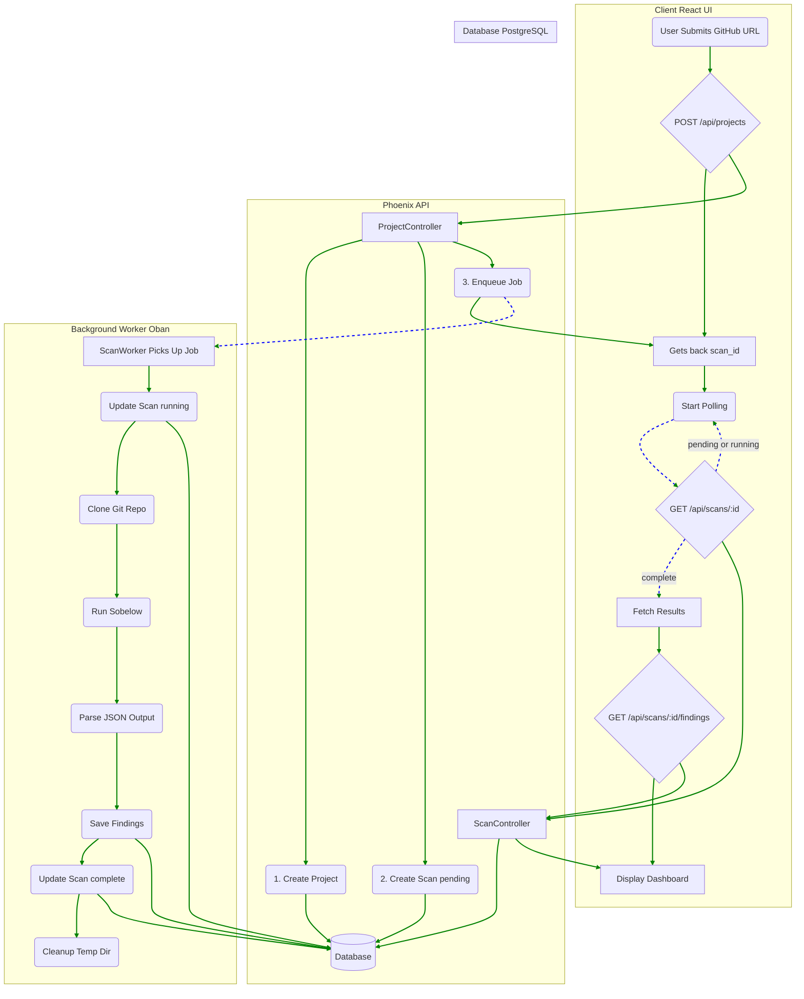

# sobelow-dashboard
Paste a link to a public GitHub repository, click Scan, and see a dashboard of all the security vulnerabilities found by Sobelow.

# Rough Flow Chart

```mermaid
flowchart TD
    %% Define Subgraphs for clarity
    subgraph Client [Client React UI]
        A(User Submits GitHub URL) --> B{POST /api/projects};
        B --> C[Gets back scan_id];
        C --> D(Start Polling);
        D -.-> E{GET /api/scans/:id};
        E -.-> |pending or running| D;
        E -.-> |complete| F[Fetch Results];
        F --> G{GET /api/scans/:id/findings};
        G --> H[Display Dashboard];
    end

    subgraph API [Phoenix API]
        direction LR
        B --> I[ProjectController];
        I --> J(1. Create Project);
        I --> K(2. Create Scan pending);
        I --> L(3. Enqueue Job);
        L --> C;
        
        E --> M[ScanController];
        M --> DB[(Database)];
        
        G --> M;
        M --> H;
    end

    subgraph Worker [Background Worker Oban]
        direction TB
        L -.-> N[ScanWorker Picks Up Job];
        N --> O(Update Scan running);
        O --> P(Clone Git Repo);
        P --> Q(Run Sobelow);
        Q --> R(Parse JSON Output);
        R --> S(Save Findings);
        S --> T(Update Scan complete);
        T --> U(Cleanup Temp Dir);
    end

    subgraph Database [Database PostgreSQL]
        direction TB
        J --> DB;
        K --> DB;
        O --> DB;
        S --> DB;
        T --> DB;
    end

    %% Style Links
    %% Set all links to green by default
    linkStyle default stroke:green,stroke-width:2px;
    
    %% Override just the dashed links (indices 3, 4, 5, 17) to be blue
    linkStyle 3,4,5,17 stroke:blue,stroke-width:2px,stroke-dasharray: 5 5;
```
